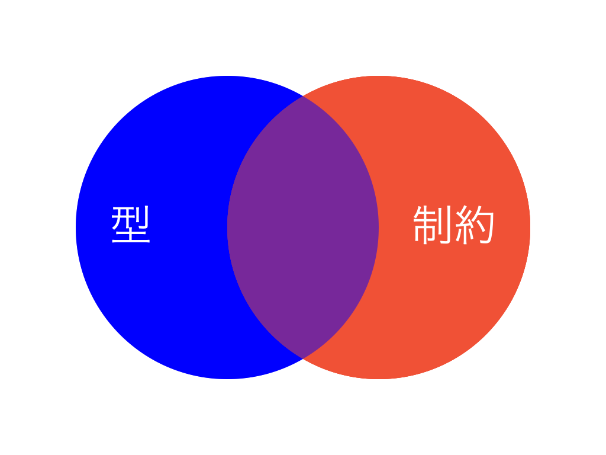
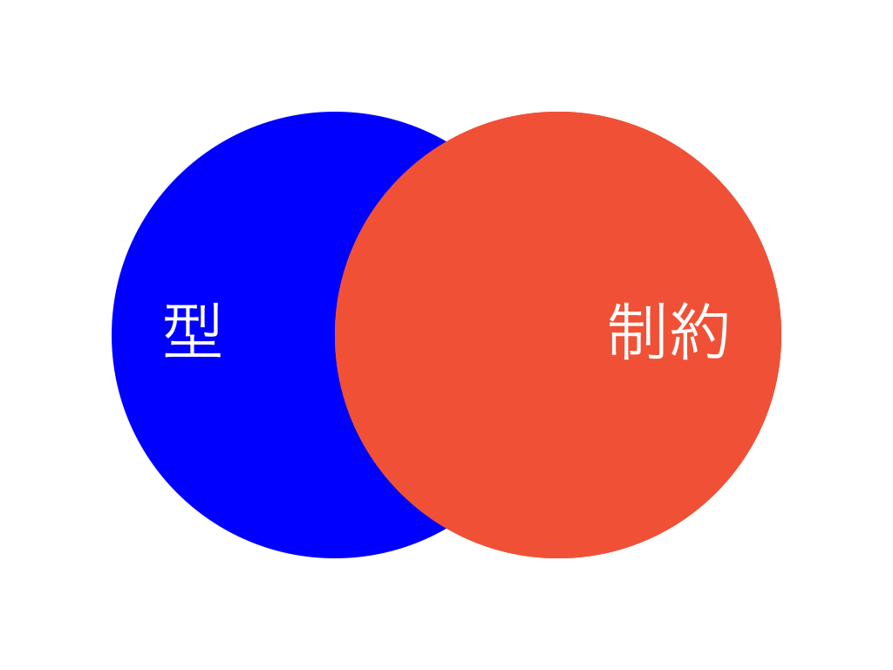





[前節]({{ prev_section.path }})で述べたように、型としてのプロトコルと制約としてのプロトコルには、どちらでもできること・どちらかでしかできないことがあります。

この関係を図で表すと次のようになります。



青い円が型としてのプロトコルでできることを、赤い円が制約としてのプロトコルでできることを表しています。二つの円の重なる部分が、「型として」・「制約として」、どちらのプロトコルでもできることです。[前節]({{ prev_section.path }})の `useAnimal` 関数はどちらでも実装できるので、この紫の領域に属しています。

```swift
// 型としてのプロトコル
func useAnimal(_ animal: Animal) {
    print(animal.foo())
}

// 制約としてのプロトコル
func useAnimal<A: Animal>(_ animal: A) {
    print(animal.foo())
}
```

型としてのプロトコルは、 _値型_ にとって実行時のオーバーヘッドが大きいプロトコルの使い方でした。そのため、 _値型_ 中心の Swift では制約としてのプロトコルを優先するのが望ましいというのが[前節]({{ prev_section.path }})の結論でした。つまり、紫の領域については制約としてのプロトコルを用いれば良いということになります。これを先程と同じように図で表すと次のようになります。



しかし、図から青い領域がなくなったわけではありません。どんな場合でもプロトコルを制約として用いれば良いというわけではないのです。青い領域に対して、制約としてのプロトコルで無理やり対処しようとすると、わかりづらく非効率なコードを書くことになるでしょう。状況に応じて、型としてのプロトコルを採用する必要があります。

本節では、型としてのプロトコルでしかできないこと・制約としてのプロトコルでしかできないことを示し、それらの使い分けについて説明します。

## 型としてのプロトコルでしかできないこと

まず、型としてのプロトコルでしかできないことの例を見てみます。

`useAnimal` 関数を少し変更して、複数の `Animal` を受け取る関数 `useAnimals` を考えてみます。元々は単一の `Animal` を引数で受け取っていましたが、複数の `Animal` を受け取るために引数の型を `[Animal]` に変更しています。

```swift
// 型としてのプロトコル
func useAnimals(_ animals: [Animal]) {
    ...
}
```

上記の引数 `animals` は任意の `Animal` を要素として格納できる `Array` です。次のように、 `Cat` インスタンスと `Dog` インスタンスを混在させることも可能です。

```swift
// 型としてのプロトコル
useAnimals([Cat(), Dog()]) // ✅
```

このように、異なる型のインスタンスが混在したコレクションを _Heterogeneous Collection_ と呼びます。

制約としてのプロトコルでは、これと同じことができません。制約としてのプロトコルを使って `useAnimal` 関数を実装してみましょう。

```swift
// 制約としてのプロトコル
func useAnimals<A: Animal>(_ animals: [A]) {
    ...
}
```

しかし、この関数に `Cat` と `Dog` が混在した _Heterogeneous_ な `Array` を渡すことはできません。

```swift
// 制約としてのプロトコル
useAnimals([Cat(), Dog()]) // ⛔ コンパイルエラー
```

`useAnimals` の引数の型は `[A]` です。型パラメータ `A` に当てはめることができるのは `Cat` や `Dog` などの具体的な型だけです。 `Animal` のような抽象的な型を当てはめることはできません。

`useAnimals` に渡すことができるのは _Heterogeneous_ **でない** `Array` だけです。

```swift
useAnimals([Cat(), Cat()]) // ✅ [Cat] を渡す（ A は Cat）
useAnimals([Dog(), Dog()]) // ✅ [Dog] を渡す（ A は Dog）
```

このような、同種の値だけを格納した（ _Heterogeneous_ **でない** ）コレクションを _Homogeneous Collection_ と呼びます。制約としてのプロトコルを使うと、 _Homogeneous Collection_ を表すことはできますが _Heterogeneous Collection_ を表すことはできません。

このように、 **_Heterogeneous Collection_ が必要な場合には、プロトコルを制約として使うのではなく型として使う** 必要があります。

### 型パラメータ `A` に `Animal` を当てはめられない理由

どうして型パラメータ `A` には `Cat` や `Dog` のような具体的な型しか当てはめられないのでしょうか。 `A` に `Animal` を当てはめることができれば、先の `useAnimals` に `[Animal]` 型の値を渡すことができます。

一般的に Swift の型システム上では、プロトコル型はそのプロトコル自体に適合しません。たとえば、 `Animal` 型は `Animal` プロトコル自体に適合しないので、次の `useAnimal` に `Animal` 型の値を渡すこともできません。

```swift
func useAnimal<A: Animal>(_ animal: A) { ... }

let animal: Animal = Cat()
useAnimal(animal) // ⛔ コンパイルエラー
```

プロトコル型がそのプロトコル自体に適合することを **_Self-conformance_** と言います。上で見たように、一般的な Swift のプロトコルは _Self-conformance_ を持ちません。プロトコル型はそのプロトコルのメンバをすべて持つので、プロトコルが _Self-conformance_ を持っても一見問題なさそうに思えます。しかし、たとえば `Animal` や `Cat`, `useAnimal` が次のように実装されていると破綻してしまいます。

```swift
protocol Animal {
    static func foo() -> Int
}
struct Cat: Animal {
    static func foo() -> Int { 2 }
}

func useAnimal<A: Animal>(_ animal: A) {
    print(A.foo()) // 🤔 A が Animal のときどうなる？
}
```

`A` が `Animal` のとき、 `Animal.foo()` には具体的な実装が存在しません。プロトコルが `static` なメンバを要求する場合、 _Self-conformance_ にはこのような問題があります。他にも、イニシャライザを要求する場合などに同種の問題を引き起こします。

そのような理由から、 Swift ではプロトコルの _Self-conformance_ はサポートされていません。ただし、例外的に [SE-0235](https://github.com/apple/swift-evolution/blob/master/proposals/0235-add-result.md) で `Error` プロトコルに _Self-conformance_ が[追加されました](https://github.com/apple/swift-evolution/blob/master/proposals/0235-add-result.md#adding-swifterror-self-conformance)）。今後、 _Self-conformance_ が問題にならないケースでは _Self-conformance_ がサポートされる可能性があります。

### Heterogeneous Collection の具体例

型としてのプロトコルが必要になるケースとして、 _Heterogeneous Collection_ を挙げました。では、実際にどのような場合に _Heterogeneous Collection_ を使いたくなるのでしょうか。

代表的な例は、 GUI のビューツリーです。典型的な GUI のビューは、各ビューが複数の子ビューを持つ階層的なツリー構造を持ちます。

今、ビューを `View` プロトコルで表すとし、 `View` は複数の子ビューを持つとしましょう。その複数の子ビューは `subviews` プロパティで表されるものとします。このとき、 `View` プロトコルは次のように書けます。

```swift
// 型としてのプロトコル
protocol View {
    var subviews: [View] { get } // 👈 ここで「型として」使われている
    ...
}
```

`subviews` プロパティの型 `[View]` に型としてのプロトコルが使われています。

`subviews` は _Heterogeneous_ な `Array` なので、異なる種類のビューを格納できます。この性質は、次のようにチェックボックスやラベル、ボタンなどを同一の階層にフラットに並べたいときに必要になります。

<div class="html-demo">
    <div><input type="checkbox" /> 利用規約に同意します。</div>
    <div><button>送信</button></div>
</div>

これをコードで表すと次のようになります（ `ViewGroup`, `Checkbox`, `Label`, `Button` は `View` プロトコルに適合しているものとします）。

```swift
// 型としてのプロトコル
let viewGroup = ViewGroup([
    Checkbox(),
    Label("利用規約に同意します。"),
    Button("送信"),
]) // ✅
```

もし制約としてのプロトコルを使って同じことを書こうとするとどうなるでしょうか。 `View` プロトコルは次のようになります。

```swift
// 制約としてのプロトコル
protocol View {
    associatedtype Subview: View // 👈 ここで「制約として」使われている
    var subviews: [Subview] { get }
    ...
}
```

`associatedtype Subview` の制約として `View` プロトコルが使われています。この `Subview` は `subviews` プロパティの型 `[Subview]` に用いられています。

このとき、 `ViewGroup` は次のようになります。

```swift
// 制約としてのプロトコル
struct ViewGroup<Subview: View>: View {
    var subviews: [Subview]
    // ...
}
```

しかし、これでは `subviews` は _Heterogeneous_ になれません。単一の何かのビュー型を型パラメータ `Subview` に指定し、そのビュー型の要素しか `subviews` に格納することはできません。 `Checkbox` と `Label`, `Button` を一度に格納することはできないのです。

```swift
// 制約としてのプロトコル
let viewGroup = ViewGroup<???>([ // ??? のところに View とは書けない
    Checkbox(),
    Label("利用規約に同意します。"),
    Button("送信"),
]) // ⛔ コンパイルエラー
```

`???` のところに `View` と書きたいところですが、 _Self-conformance_ がないのでそれもできません。

この例のように、型としてのプロトコルが適切なケースでは、制約としてのプロトコルにこだわる必要はありません。無理やり制約としてのプロトコルを使っても、冗長でわかりづらいコードになってしまいます。素直に型としてのプロトコルを使用するのが良いでしょう。

#### Generalized Existential と型消去

[SwiftUI](https://developer.apple.com/documentation/swiftui) に親しんだ読者の中には、先の `View` プロトコルの例に違和感を覚える方もいるかもしれません。

SwiftUI には、先の例と同じように `View` プロトコルが存在します。しかし、 `View` プロトコルが型として用いられることはありません。なぜなら、 SwiftUI の `View` プロトコルには `associatedtype Body` が存在するからです。

```swift
// SwiftUI
protocol View {
    associatedtype Body : View
    var body: Body { get }
    ...
}
```

Swift では `associatedtype` を持つプロトコルを型として使用することは許されていません。そのため、次のようなコードは書けません。 `View` が型として使用されているためコンパイルエラーになります。

```swift
let views: [View] = [Text("..."), Image("...")] // ⛔ コンパイルエラー
```

しかし、 `associatedtype` を持つプロトコルが型として使用できないのはコンパイラの実装上の都合です。理論上の問題があるわけではありません。将来的に、 `associatedtype` を持つプロトコルも型として使えるようにしようということが[議論されています](https://github.com/apple/swift/blob/master/docs/GenericsManifesto.md#generalized-existentials)。そのような、 `associatedtype` を持ったプロトコルで表される型は **_Generalized Existential_** と呼ばれています。 _Generalized Existential_ がサポートされた場合、上記のコードはコンパイル可能なコードとなります。

そうは言っても、現状で _Generalized Existential_ はサポートされていません。しかし、これまで見てきたように、型としてのプロトコルが必要になるケースもあります。そのようなケースではどうすれば良いでしょうか。

そのような目的で用意されているワークアラウンドが **_型消去（ Type Erasure ）_** です。 `View` プロトコルを型として使用する代わりに、上記のコードは `AnyView` を使って次のように書けます。

```swift
let views: [AnyView] = [AnyView(Text("...")), AnyView(Image("..."))] // ✅
```

Swift の標準ライブラリにも、 `AnySequence` や `AnyHashable` などの型が用意されています。

## 制約としてのプロトコルでしかできないこと

ここまで、型としてのプロトコルでしかできないことを見てきました。次に、制約としてのプロトコルでしかできないことを見てみましょう。

制約としてのプロトコルでしかできないことの代表的な例が **_Self-requirement_** です。たとえば、 `Equatable` プロトコルでは _Self-requirement_ が使われています。


```swift
protocol Equatable {
    static func == (
        lhs: Self, // Self-requirement
        rhs: Self  // Self-requirement
    ) -> Bool
}
```

上記のコード中の `Self` が _Self-requirement_ です。プロトコルの中に記述された `Self` は、そのプロトコルに適合した型を実装する際に、その型自体に置き換えられなければなりません。たとえば、 `Int` を `Equatable` に適合させる場合には `Self` は `Int` に、 `String` を `Equatable` に適合させる場合には `Self` は `String` に置き換えられます。

```swift
extension Int: Equatable {
    static func == (
        lhs: Int, // Self が Int に置き換えられる
        rhs: Int  // Self が Int に置き換えられる
    ) -> Bool { ... }
}
```

```swift
extension String: Equatable {
    static func == (
        lhs: String, // Self が String に置き換えられる
        rhs: String  // Self が String に置き換えられる
    ) -> Bool { ... }
}
```

_Self-requirement_ を持つプロトコルは型としては使用せず、制約として使うことだけが想定されています。 `Self` を持つプロトコルを型として使おうとするとコンパイルエラーになります（正確には、 _Contravariant Position_ （引数など）に `Self` を持つ場合に型として使用することができません。 _Covariant Position_ （戻り値など）にしか `Self` を持たないプロトコルは型として使用することができます）。

```swift
// 型としてのプロトコル
let a: Equatable = 42 // ⛔ コンパイルエラー
```

どうして _Self-requirement_ を持つプロトコルは型として使えないのでしょうか。仮に `Equatable` プロトコルが型として使えると何が起こるか見てみましょう。

`Equatable` プロトコルが型として使用できるなら、 `Int` も `String` も `Equatable` プロトコルに適合しているので、 `Int` 型と `String` 型の値をそれぞれ `Equatable` 型の変数に代入することができます。しかし、それらを `==` で比較しようとすると何が起こるでしょうか。

```swift
// 型としてのプロトコル
let a: Equatable = 42
let b: Equatable = "42"
a == b // 🤔 Int と String の比較はどこにも実装されていない
```

`Equatable` プロトコルは、自身を比較するための `==` 演算子を要求します。しかし、 `Int` と `String` が実装しているのは、それぞれ `Int` 同士・ `String` 同士の演算だけで、 `Int` と `String` を比較したときの処理はどこにも実装されていません。

上記のコードのように、 `42` という整数と `"42"` という文字列を比較した場合、どのような結果を返せば良いでしょうか。値の型が異なるので `false` を返すという考え方もあれば、 JavaScript のように文字列に変換すると同じなので `true` を返すという考え方もあります。つまり、実装次第です。そして、 `Int` と `String` を比較する `==` の実装はどこにもありません。静的型付言語としては、 `a == b` をコンパイルエラーにするしかありません。

```swift
// 型としてのプロトコル
let a: Equatable = 42
let b: Equatable = "42"
a == b // ⛔ コンパイルエラーにするしかない
```

さらに、たとえ `42` という同じ `Int` 型の値同士であったとしても、 `a == b` はコンパイルエラーにせざるを得ません。

下記のコードでは `a` と `b` に代入されている値はどちらも `Int` ですが、下記のコードの `a == b` と上記のコードの `a == b` はどちらも `Equatable` 同士を `==` 演算子で比較しているという点では同じです。 `a == b` という式の型はまったく同じであり、上記をコンパイルエラーとするなら下記もコンパイルエラーでなければなりません。

```swift
// 型としてのプロトコル
let a: Equatable = 42
let b: Equatable = 42
a == b // ⛔ Int 同士でも Equatable を介すとコンパイルエラー
```

`Equatable` 型同士を `==` で比較できないなら、 `Equatable` プロトコルを型として使ってできることは何もありません。 `Equatable` 型にできることが何もないのであれば、それは `Any` 型と同じです。

```swift
let a: Any = 42
let b: Any = 42
a == b // ⛔ Any 同士に == は実装されていないのでコンパイルエラー
```

つまり、 `Equatable` プロトコルを型として使うことに意味はありません。意味がないのであれば型として使うこと自体をコンパイラが禁止するのが妥当でしょう。これが、 _Self-requirement_ を持つプロトコルが型として使えない理由です。

_Self-requirement_ を持つプロトコルは、次のように、制約として使うことだけが想定されています。

```swift
// 制約としてのプロトコル
extension Sequence where Element: Equatable { // Equatable が制約として使われている
    func contains(_ element: Element) -> Bool {
        ...
    }
}
```

このように、制約としてのプロトコルでしかできないこともあります。

## まとめ

[前節]({{ prev_section.path }})から見てきたように、プロトコルは型としても制約としても使うことができます。型としてのプロトコルは、 _値型_ にとって実行時のオーバーヘッドが大きいので、どちらでも良いケースでは制約としてプロトコルを使用する方が Swift に適しています。しかし、すべてのケースを制約として書けるわけではありません。「型として」・「制約として」のプロトコルを適切に使い分ける必要があります。

本節では、型としてのプロトコルが必要となる例として _Heterogeneous Collection_ を、制約としてのプロコトルが必要となる例として _Self-requirement_ を挙げました。また、それらの具体的なユースケースとして、 GUI のビューツリーと `Equatable` プロトコルの `==` 演算子をそれぞれ紹介しました。
