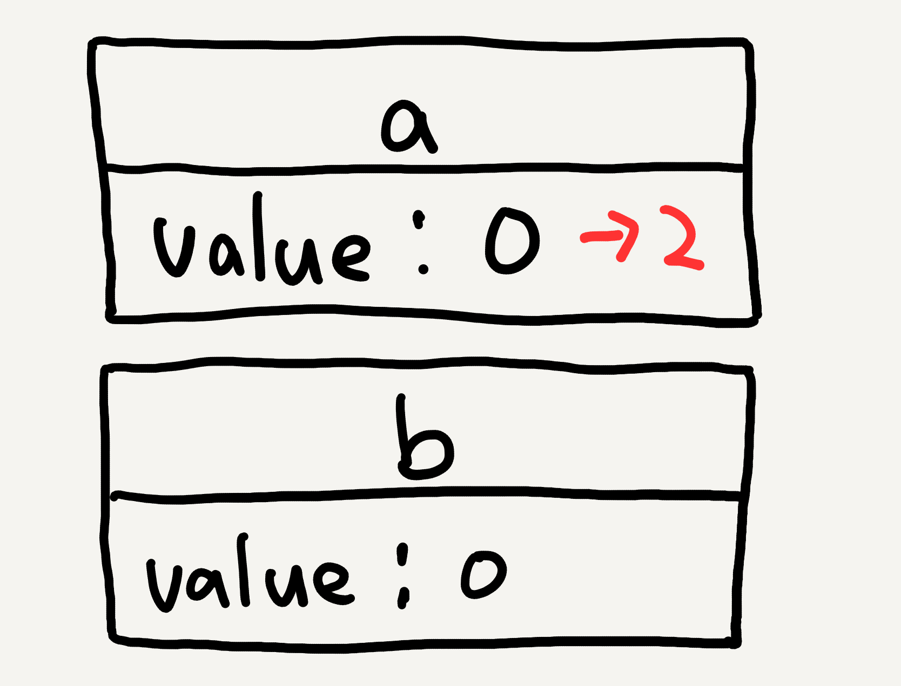
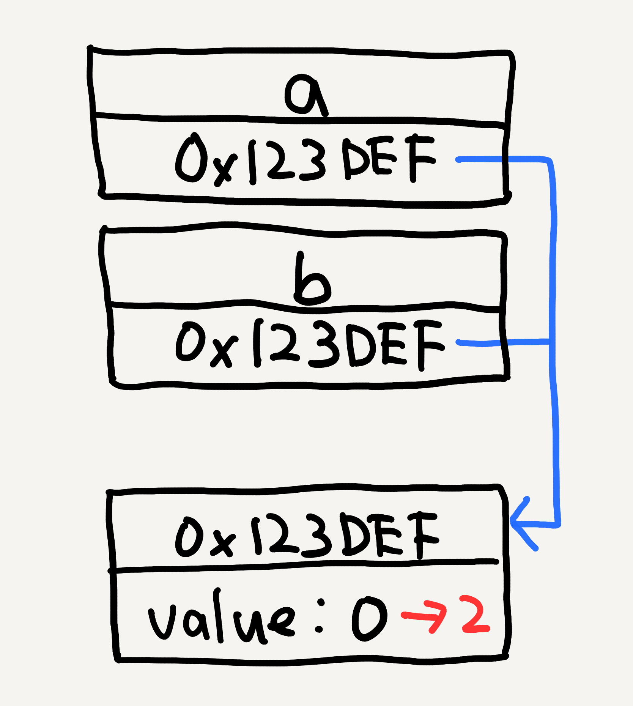
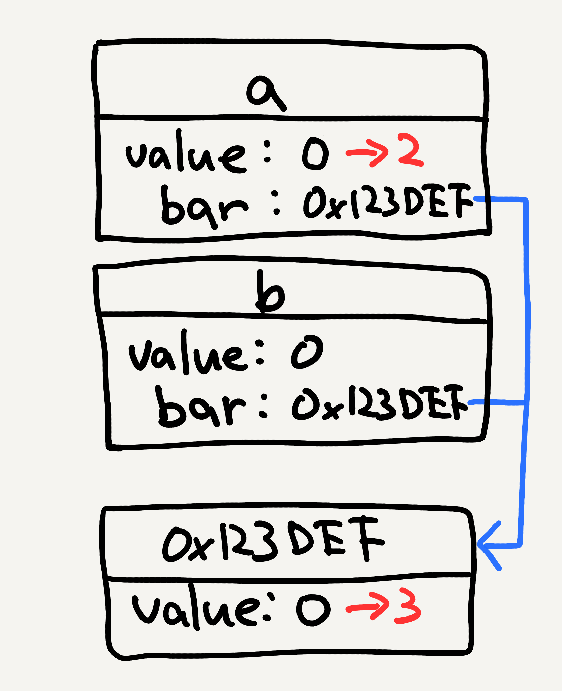

**_Value Semantics_** という用語は C++ などの言語で用いられることが多いようです。しかし、 Swift における _Value Semantics_ は、それらとは少し異なるニュアンスを持っています。 WWDC 2015 のセッション ["Building Better Apps with Value Types in Swift"](https://developer.apple.com/videos/play/wwdc2015/414/) の中で Swift における _Value Semantics_ について詳しく説明されていますが、残念ながらその定義については述べられていません。 Swift における _Value Semantics_ の定義は、 [Swift のリポジトリ](https://github.com/apple/swift)の中のドキュメント ["Value Semantics in Swift"](https://github.com/apple/swift/blob/master/docs/proposals/ValueSemantics.rst) に記載されています。

これは 201３ 年に書かれた古いドキュメントで、 [docs/proposals](https://github.com/apple/swift/blob/master/docs/proposals) という正式に認められていないドキュメントが収められたディレクトリの中にありますが、 Swift Core Team の Dave Abrahams さんがその著者であり、内容も WWDC で話されていることと一貫性があるので、信頼のおけるドキュメントだと筆者は考えています。

このドキュメントの中で、 _Value Semantics_ は次のように定義されています。

> For a type with value semantics, variable initialization, assignment, and argument-passing each create an independently modifiable copy of the source value that is interchangeable with the source.
>
> （参考訳）ある型が Value Semantics を持っているとき、その型の変数を初期化したり、値を代入したり、引数に渡したりすると、元の値のコピーが作られて、そのコピーと元の値は独立に変更することができる。つまり、どちらかを変更してももう片方には影響を与えない。
>
> ["Value Semantics in Swift"](https://github.com/apple/swift/blob/master/docs/proposals/ValueSemantics.rst)

コードを使って例を挙げてみます。

## Value Semantics を持つ例

`value` という Stored Property を一つだけ持つシンプルな `struct` 、 `Foo` を考えてみます。

```swift
struct Foo {
    var value: Int = 0
}
```

この `Foo` を使って次のような処理を考えます。

```swift
var a = Foo()
var b = a
a.value = 2
```

このときに、 `b.value` も変更されるかというのが問題です。結論から言うと、 `Foo` は **_値型_** なので `a.value` を変更しても `b.value` は変更されません。

_値型_ のインスタンスは変数に直接格納されています。インスタンスを表すバイト列が、メモリ上のその変数を表す領域に直接書かれているわけです。 _値型_ のインスタンスを変数に代入したときには、そのインスタンスを表すバイト列がコピーされて代入先の変数の領域にそのまま書き込まれます。これが _値型_ のインスタンスがコピーされる仕組みです。

上記の例では、 `var b = a` をした時点で `a` の領域に格納されたバイト列が `b` の領域にコピーされるわけです。代入直後の時点では、 `a` と `b` には同じ内容のバイト列が書かれていますが、それらは内容が同じ別々の `Foo` インスタンスを表しています。 `a.value` を変更しても `a` の領域の `value` のバイト列が変更されるだけで、 `b.value` が変更されることはありません。



今、 `a` と `b` は変更に対して独立である、つまり、 `a` と `b` のどちらかに変更を加えてももう一方には影響を及ぼさないので、 `Foo` は _Value Semantics_ を持っていると言えます。

## Value Semantics を持たない例

次に、 _Value Semantics_ を持たない例を見てみます。先程のコードの `struct` だった部分を `class` に変更します。それ以外はまったく同じです。

```swift
class Foo {
    var value: Int = 0
}

var a = Foo()
var b = a
a.value = 2
```

この場合は、 `Foo` はクラスなので **_参照型_** です。そのため、 `a.value` を変更することで `b.value` も変更されてしまいます。

_参照型_ のインスタンスは変数に直接格納されません。インスタンスの実体を表すバイト列はメモリ上の別の領域（ヒープ領域のどこか）に格納されていて、その領域を表すメモリのアドレスが変数に格納されます。たとえば、そのアドレスが `0x123DEF` だとすると、変数に実際に格納されているのは `0x123DEF` というアドレスを表すバイト列です。 `var b = a` では、 `a` に格納されたアドレス `0x123DEF` を表すバイト列が `b` にコピーされます。このとき、 `a` と `b` は同じアドレス `0x123DEF` を介して同一の `Foo` インスタンスを参照することになります。そのため、 `a.value` を変更すると `b.value` も変更されてしまうわけです。



この例では変更に対する独立性を持たないので、 `Foo` は _Value Semantics_ を持ちません。 

このように、片一方を変更するともう一方も変更される場合、 _Value Semantics_ と対比して、その型は **_Reference Semantics_** を持っていると言われます。

## Semantics vs Type

先の例や名前からも推測できる通り、 _Value Semantics_ は _値型（ Value Type ）_ と、 _Reference Semantics_ は _参照型（ Reference Type ）_ と深い関係があります。しかし、これらは同じものではありません。混同してしまわないように注意が必要です。

- _Value Semantics_ ≠ _値型（ Value Type ）_
- _Reference Semantics_ ≠ _参照型（ Reference Type ）_

たとえば、 **_値型_ だけど _Value Semantics_ を持たない型** や、 **_参照型_ だけど _Reference Semantics_ を持たない型も存在します**。 _Value Semantics_ ／ _Reference Semantics_ と、 _値型_ ／ _参照型_ をきちんと区別して考えることが重要です。

## 値型だけど Value Semantics を持たない例

Semantics と Type を区別して考えるために、値型だけれども _Value Semantics_ を持たない例を見てみましょう。

`struct Foo` に加えて、 `Bar` というクラスを導入します。

```swift
class Bar {
    var value: Int = 0
}
```

この `Bar` 型のプロパティを `Foo` に追加します。

```swift
struct Foo {
    var value: Int = 0
    var bar: Bar = Bar() // 👈
}
```

これを使って先程と似たようなことをしてみます。ただし、 `a.value` を変更するのに加えて `a.bar.value` も変更します。

```swift
var a = Foo()
var b = a
a.value = 2
a.bar.value = 3 // 👈
```

このとき、 `Foo` は _値型_ なので変数 `a`, `b` には独立した別々の `Foo` インスタンスが格納されます。しかし、 `Bar` は _参照型_ なので、 `a` と `b` の `bar` プロパティには同じ `Bar` インスタンスのアドレスが格納され、そのアドレスを介して同じインスタンスを参照していることになります。

その状態で `a.value` を変更しても、 `a` と `b` には異なる `Foo` インスタンスが格納されているので `b.value` には影響を与えません。しかし、 `a.bar` と `b.bar` は同じ `Bar` インスタンスを参照しているので、 `a.bar.value` に変更を加えると `b.bar.value` も変更されます。



そのため、 `Foo` は _値型_ であるにも関わらず変更に対する独立性を持たない、つまり _Value Semantics_ を持たないことになります。なお、 `a.value` と `b.value` は独立に変更できるので、この `Foo` は _Reference Type_ も持ちません。

この `Foo` のように _Value Semantics_ も _Reference Semantics_ も持たない型は扱いづらく、そのような型を作ってしまわないように注意が必要です。そんな変な型を作ることはないと思うかもしれませんが、たとえば下記に挙げたようなクラスのインスタンスを _値型_ のプロパティに持たせると、簡単に _Value Semantics_ も _Reference Semantics_ も持たない型ができあがってしまいます。

- `NSMutableArray`, `NSMutableString`, `NSMutableData`
- `UILabel`, `UISwitch`, `UISlider`
- `AVAudioPlayer`
- `CMMotionManager`

## 参照型プロパティを持つ値型でも Value Semantics を持つ例

先の例は、一見 _参照型_ のプロパティを持ったことが _Value Semantics_ を失った原因のように思えます。しかし、 _参照型_ のプロパティを持つことで必ずしも _Value Semantics_ が失われるわけではありません。次は、 _参照型_ のプロパティを持つ _値型_ が _Value Semantics_ を持つ例を見てみます。

先のコードの `Bar` クラスを _イミュータブルクラス_ に変更します。

```swift
final class Bar {
    let value: Int = 0
}
```

`Bar` クラスを _イミュータブル_ にするために、 `Bar` の `value` プロパティを `let` にして、 `final class` に変更します。 `final class` にするのは、 `Bar` の _ミュータブル_ なサブクラスが作られてしまうと `Bar` 型の _イミュータビリティ_ が破壊されてしまうからです。

この `Foo` と `Bar` を使って先程と同じことをしてみます。そうすると、 `Bar` は今 _イミュータブルクラス_ なので、 `a.bar.value` を変更しようとすると当然コンパイルエラーになります。

```swift
var a = Foo()
var b = a
a.value = 2
a.bar.value = 3 // ⛔
```

このケースでは、たしかに `a.bar` と `b.bar` は同じインスタンスを参照していますが、 `Bar` は _イミュータブル_ なので、そのインスタンスを通して状態を変更することはできません。そのため、 `Bar` 型のプロパティを持つことが `Foo` インスタンスの変更に対する独立性を破壊することにはつながりません。結果として、 `Foo` は _参照型_ のプロパティを持つにも関わらず _Value Semantics_ を持つということになります。

このようなケースはよく見られ、たとえば次のようなクラスのインスタンスをプロパティに保持しても _Value Semantics_ を破壊する原因にはなりません。

- `NSNumber`, `NSNull`
- `UIImage`
- `KeyPath`

## イミュータビリティと Semantics

_イミュータブルクラス_ 自体の Semantics はどのように考えれば良いでしょうか。

次のような _イミュータブルクラス_ `Foo` を考えます。

```swift
final class Foo {
    let value: Int = 0
}
```

この `Foo` に対して、同様の処理を行います。

```swift
var a = Foo()
var b = a
a.value = 2 // ⛔
```

_イミュータブルクラス_ のインスタンスはそもそも変更することができないので、片方を変更するともう片方も変更されるということは起こりません。 "Value Semantics in Swift" には、そのようなケースも _Value Semantics_ を持つと書かれています。

また、 "Value Semantics in Swift" には興味深いことが書かれていて、 _イミュータビリティ_ を持つ場合は _Value Semantics_ と _Reference Semantics_ が区別できないとあります。そのため、上記のような _イミュータブル_ な `Foo` クラスは _Value Semantics_ と _Reference Semantics_ を両方持つと言えます。また、 _イミュータブル_ であれば、 _値型_ であっても _Reference Semantics_ を持つと言えるでしょう。たとえば、次の `Foo` は _値型_ ですが _Value Semantics_ と _Reference Semantics_ の両方を持っています。

```swift
struct Foo {
    let value: Int = 0
}
```

## ミュータブルな参照型をプロパティに持つけど Value Semantics を持つ例

先程の例では、 _ミュータブル_ な _参照型_ のプロパティを持つ場合は _Value Semantics_ を持ちませんでした。

```swift
struct Foo {
    var value: Int = 0
    var bar: Bar = Bar()
}

class Bar {
    var value: Int = 0
}
```

しかし、「 _ミュータブル_ な _参照型_ のプロパティを持つ場合は _Value Semantics_ を持たない」というようにパターンで判断するのは危険です。たとえば、標準ライブラリの `Array` は内部に _ミュータブル_ な _参照型_ を保持していますが、 _Copy-on-Write_ という仕組みを使って _Value Semantics_ を実現しています。

_Value Semantics_ を持つかどうかはパターンで判断するのではなく、定義に基づいて判断することが大切です。

## まとめ

Swift における _Value Semantics_ の定義は、ある型が _Value Semantics_ を持つとき、その型の値が変更に対して独立であるということです。

_値型_ と _Value Semantics_ 、 _参照型_ と _Reference Semantics_ は同じものではなく、 _値型_ だからといって _Value Semantics_ を持つとは限りませんし、 _参照型_ でも _Value Semantics_ を持つこともあります。 Type と Semantics を区別して理解することが重要です。 _Value Semantics_ を持つかどうかをパターンに当てはめて考えると、様々な例外を考慮しなければなりません。 _Value Semantics_  を持つかどうかは定義に基づいて判断しましょう。
